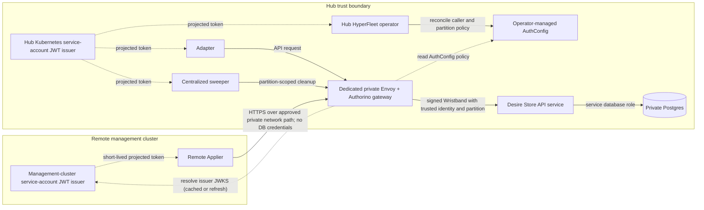
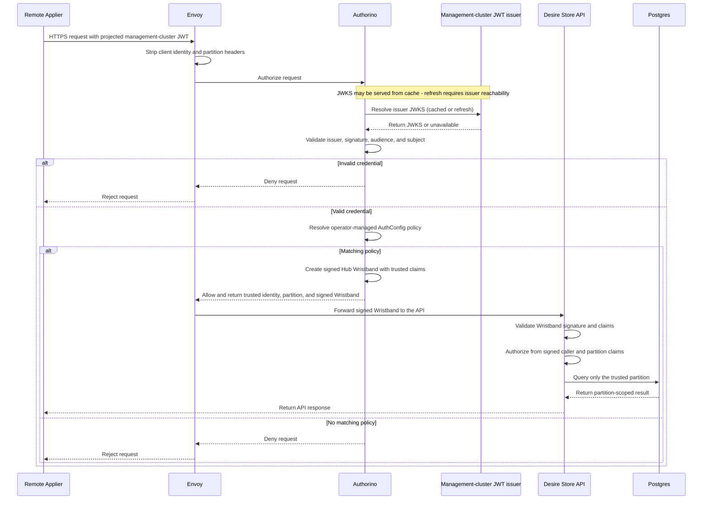

# Desire Store Architecture Overview

## Table of Contents

- [Related Documents](#related-documents)
- [Purpose and Scope](#purpose-and-scope)
- [Architecture](#architecture)
  - [Request Flow](#request-flow)
- [Callers and Boundaries](#callers-and-boundaries)
- [Trust Boundaries and Partition Isolation](#trust-boundaries-and-partition-isolation)
- [Remote Applier Authentication](#remote-applier-authentication)
  - [Credential Source](#credential-source)
  - [Key Trust](#key-trust)
- [Identity-to-Partition Binding](#identity-to-partition-binding)
- [Desire Store API Hosting](#desire-store-api-hosting)
- [Transport](#transport)
- [Database Protection and Partition Isolation](#database-protection-and-partition-isolation)
- [Capacity and Rate Limits](#capacity-and-rate-limits)
- [AuthConfig Impact](#authconfig-impact)

## Related Documents

- [ADR-0022: API-Mediated Desire Store Access](../adrs/0022-api-mediated-desire-store-access.md)
- [ADR-0020: Envoy and Authorino API Gateway](../adrs/0020-envoy-authorino-api-gateway.md)
- [Remote Applier Connectivity and Partition-Scoped Access to Postgres](spike-remote-applier-postgres-access.md)
- [ADR-0029: Desire Store Authorization](../adrs/0029-desire-store-authorization.md)

## Purpose and Scope

The Desire Store is a rebuildable delivery channel between Adapters running on the Hub cluster and Appliers running on management clusters. This document describes the high-level architecture, trust boundaries, callers, and major decisions. A follow-up Detailed Design (DD) will define the API behavior.

## Architecture

### Request Flow

## Callers and Boundaries

| Caller | Location | Main responsibility |
|--------|----------|---------------------|
| Adapter | Hub | Writes desired state and cleanup records. |
| Remote Applier | Management cluster | Reads desires and writes status. |
| Centralized sweeper | Hub | Finds and cleans up orphaned desires. |
| HyperFleet operator | Hub | Reconciles remote caller identities and partition mappings. It is not a Desire Store data caller. |

The gateway authenticates each Desire Store data caller and provides its caller class in the signed Wristband. [ADR-0029](../adrs/0029-desire-store-authorization.md) defines caller authorization and partition-selection rules; the Detailed Design will define the concrete AuthConfig, gateway, and API configuration used to enforce them.

## Trust Boundaries and Partition Isolation

The Hub and each management cluster are separate trust boundaries. Remote management clusters reach the private Hub gateway through an approved private network path; the gateway is not publicly exposed.

## Remote Applier Authentication

Remote Applier authentication and partition binding are defined in [ADR-0029](../adrs/0029-desire-store-authorization.md). This section summarizes the resulting trust and deployment implications.

### Credential Source

Use projected Kubernetes service-account JWTs issued by the management cluster. This avoids distributing Hub or database credentials to management clusters. The Hub trusts only registered management-cluster service-account identities.

**Alternatives:**

- **OCI workload identity:** Not selected because it couples the design to one cloud IAM system.
- **Hub-minted bearer credentials:** Not selected because they require a separate issuance and renewal service.

**Trade-off:** The Hub must trust each registered management-cluster issuer, but no Hub or database credentials are distributed to management clusters.

**Acceptable because:** Projected tokens avoid distributing Hub credentials, while the Hub's issuer, audience, and service-account subject checks limit trust to registered identities.

### Key Trust

Use OIDC discovery/JWKS for registered management-cluster issuers. The Hub retrieves public keys, supports key rotation, and requires issuer reachability.

The management-cluster operator must publish the registered issuer's discovery/JWKS endpoint and keep it reachable over the approved private path. If discovery or JWKS retrieval fails, the gateway denies authorization. An issuer discovery failure denies that issuer's requests without invalidating unrelated AuthConfig entries.

Issuer selection must avoid trying unrelated AuthConfig entries for each request. JWKS refresh must be bounded and cancellation-aware to prevent request fan-out across management-cluster issuers.

The high-level issuer, key, and Wristband trust model is defined by [ADR-0029](../adrs/0029-desire-store-authorization.md). The Detailed Design will define the concrete validation configuration, token lifetimes, caching, and revocation behavior.

**Alternative:** Onboarding key registration avoids issuer reachability at request time, but rotations require an explicit update.

**Trade-off:** The Hub depends on issuer reachability and AuthConfig reconciliation for onboarding and revocation. JWKS and token/Wristband caching may affect verification timing. The gateway must also issue and the API must validate the Wristband consistently.

**Acceptable because:** OIDC discovery supports issuer-managed key rotation, while the signed Wristband gives the API a trusted identity and partition even if the network boundary is bypassed.

## Identity-to-Partition Binding

The Hub operator manages AuthConfig entries that map each remote Applier identity to exactly one management-cluster partition, as defined in [ADR-0029](../adrs/0029-desire-store-authorization.md). Existing issuer, audience, and JWKS settings do not define that binding; the operator and gateway configuration must add it.

**Trade-off:** Operator-managed AuthConfig avoids a runtime registry lookup, but requires new dynamic reconciliation and timely propagation of onboarding, replacement, and revocation changes.

**Acceptable because:** Authorino supports live AuthConfig reconciliation, so the operator can manage partition policy without adding a separate registry service once the required per-cluster support is implemented.

## Desire Store API Hosting

The Desire Store API is a dedicated Hub service behind its own private Envoy and Authorino gateway. This separates Desire Store traffic, scaling, rollout, and service-level failure behavior from the general API. It uses a dedicated `desire_store` database on the shared Postgres instance, as defined by [ADR-0026](../adrs/0026-co-located-service-databases-shared-postgres-isolation.md). A separate Postgres instance is a future option, not the default.

**Alternative:** Host the endpoints in the existing API, but this would couple Desire Store traffic and failures to the general API's resources and releases.

**Trade-off:** A dedicated service adds another deployable and private gateway configuration. A [NetworkPolicy](https://redhat.atlassian.net/browse/HYPERFLEET-1613) is required to restrict API ingress to its Envoy gateway, but enforcement depends on the cluster network plugin. The signed Wristband provides defense in depth when NetworkPolicy is missing or not enforced. This does not isolate shared Postgres capacity.

**Acceptable because:** Independent scaling, rollout, and service-level failure isolation are more valuable than the additional stateless service and gateway operations.

## Transport

**Proposed direction:** Use versioned REST/JSON over HTTPS. REST keeps the service stateless and fits the bounded Desire Store operations and gateway model.

**Alternatives:**

- **gRPC:** May reduce message size and serialization overhead, but adds protocol and schema-management complexity.
- **Watch/long-poll:** May reduce repeated polling, but adds long-lived connection, timeout, and reconnect complexity.

**Trade-off:** REST polling is simple to operate and retry, but repeated polls increase gateway and API request volume when no desires have changed.

**Acceptable because:** The bounded operations fit request/response semantics, and REST reuses the existing HTTP gateway model while avoiding gRPC schema-management and watch/long-poll connection complexity. Follow-up validation can confirm whether the polling overhead is acceptable.

**Planning workload:** [HYPERFLEET-1432](https://redhat.atlassian.net/browse/HYPERFLEET-1432) models 10,000 management-cluster partitions, one Applier poll per partition every 5 seconds, and 10 desires per partition. This represents approximately 2,000 reads/sec and 20,000 status writes/sec without deduplication. [HYPERFLEET-1743](https://redhat.atlassian.net/browse/HYPERFLEET-1743) will evaluate representative payload and transport overhead before the decision is finalized.

## Database Protection and Partition Isolation

The API service enforces a trusted, non-empty partition scope before data-layer access and uses a dedicated database role restricted to the `desire_store` database. Direct database access from Appliers is not permitted.

**Alternatives:**

- **Postgres row-level security:** Provides an independent database check.
- **Per-partition sessions or credentials:** Isolates access at the database connection level.

**Trade-off:** Service-layer enforcement is simpler to operate and test, but it relies on correct application predicates. RLS adds transaction and connection-pooling complexity, while per-partition sessions or credentials add onboarding, rotation, and revocation work for every management cluster.

**Acceptable because:** Gateway authentication and network policy restrict access to the API, while partition isolation depends on the mandatory service-layer checks. A defect in those checks could expose multiple partitions. RLS can be added if security review, compliance, or implementation complexity requires an independent database control.

## Capacity and Rate Limits

Use layered protection at the gateway and API. Limit invalid traffic before authorization, apply caller-class and partition limits after authorization, and cap concurrent Desire Store database work so one caller cannot starve the rest of the fleet.

**Alternatives:**

- **Shared global rate limiter:** Provides fleet-wide quotas but adds another distributed dependency and availability concern.
- **Postgres-only protection:** Protects the database but does not prevent gateway or API resources from being exhausted first.

**Trade-off:** Local gateway limits protect each replica but cannot guarantee an exact fleet-wide quota across replicas. Stronger global quotas would add operational and availability complexity.

**Acceptable because:** Layered local limits and API concurrency protection provide a stateless starting point without adding a global rate-limit service. Numeric limits and shared-Postgres capacity remain follow-up validation work.

End-to-end transport and gateway capacity validation, including shared-Postgres contention, will use the planning workload from [HYPERFLEET-1432](https://redhat.atlassian.net/browse/HYPERFLEET-1432) before implementation limits are finalized.

## AuthConfig Impact

[ADR-0022](../adrs/0022-api-mediated-desire-store-access.md) governs API-mediated Desire Store access and mandatory partition enforcement. [ADR-0020](../adrs/0020-envoy-authorino-api-gateway.md)'s Envoy/Authorino security model applies to the dedicated Desire Store gateway, while [ADR-0029](../adrs/0029-desire-store-authorization.md) defines caller classes, partition scope, and signed Wristband authorization. For every Desire Store data caller, the API authorizes from signed Wristband claims; injected partition headers are not authoritative. The follow-up Detailed Design will define the AuthConfig structure and required operator/gateway changes.
