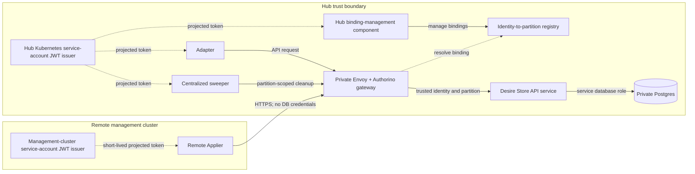
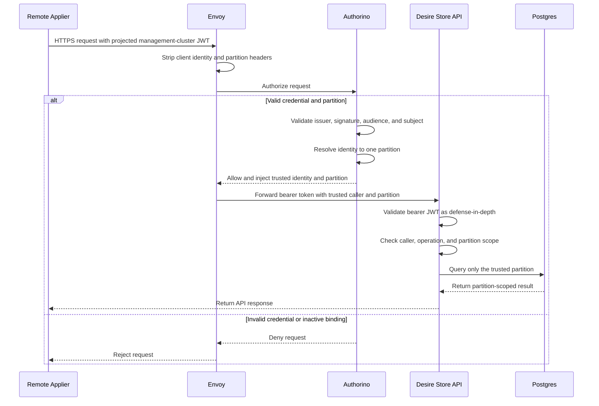

# Desire Store Architecture Overview

## Table of Contents

- [Related Documents](#related-documents)
- [Purpose and Scope](#purpose-and-scope)
- [Architecture](#architecture)
  - [Request Flow](#request-flow)
- [Callers and Boundaries](#callers-and-boundaries)
- [Trust Boundaries and Partition Isolation](#trust-boundaries-and-partition-isolation)
- [Remote Applier Authentication](#remote-applier-authentication)
- [Identity-to-Partition Binding](#identity-to-partition-binding)
- [Desire Store API Hosting](#desire-store-api-hosting)
- [Transport](#transport)
- [Database Protection and Partition Isolation](#database-protection-and-partition-isolation)
- [Capacity and Rate Limits](#capacity-and-rate-limits)
- [AuthConfig Impact](#authconfig-impact)

## Related Documents

- [ADR-0022: API-Mediated Desire Store Access](../adrs/0022-api-mediated-desire-store-access.md)
- [ADR-0020: Envoy and Authorino API Gateway](../adrs/0020-envoy-authorino-api-gateway.md)
- [Remote Applier Connectivity and Partition-Scoped Access to Postgres](spike-remote-applier-postgres-access.md)
- [ADR-0029: Cross-Cluster Applier Identity and Partition Binding](../adrs/0029-cross-cluster-applier-identity-and-partition-binding.md)

## Purpose and Scope

The Desire Store is a rebuildable delivery channel between Hub Adapters and Appliers running on management clusters. This document describes the high-level architecture, trust boundaries, callers, and major decisions. A follow-up detailed design will define the API behavior.

## Architecture

### Request Flow

## Callers and Boundaries

| Caller | Location | Scope | Main responsibility |
|--------|----------|-------|---------------------|
| Adapter | Hub | One partition authorized and injected by the gateway per request | Writes desired state and cleanup records. |
| Remote Applier | Management cluster | Exactly one registered partition | Reads its partition and writes status. |
| Centralized sweeper | Hub | One partition authorized and injected by the gateway per cleanup request | Finds and cleans up orphaned desires. |
| Binding-management component | Hub | Binding registry | Creates, replaces, and disables identity-to-partition bindings. It is not a Desire Store data caller. |

## Trust Boundaries and Partition Isolation

The Hub and each management cluster are separate trust boundaries. Remote Appliers access the Desire Store through the Hub gateway and never receive Hub or database credentials. Envoy strips caller-supplied identity and partition headers before Authorino validates the caller and injects trusted identity and partition scope.

## Remote Applier Authentication

Remote Appliers use short-lived projected Kubernetes service-account JWTs issued by their management cluster. The Hub trusts registered management-cluster issuers and validates the issuer, audience, and service-account subject before allowing access. This avoids distributing Hub or database credentials to management clusters.

**Alternatives:**

- **OCI workload identity:** Not selected because it couples the design to one cloud IAM system.
- **Hub-minted bearer credentials:** Not selected because they require a separate issuance and renewal service.

**Trade-off:** The Hub must trust and reach each registered management-cluster issuer, and a disabled binding may remain usable until the gateway cache expires.

**Acceptable because:** Short-lived projected tokens avoid distributing Hub or database credentials, while binding-cache expiry limits the revocation window and failed identity checks fail closed.

## Identity-to-Partition Binding

The Hub maintains a registry that maps each remote Applier identity to exactly one management-cluster partition. Only a Hub-owned binding-management component can create, replace, or disable a binding. Authorino resolves the active binding and injects the partition scope; the API never derives scope from client parameters or untrusted claims. The alternatives and rationale are recorded in [ADR-0029](../adrs/0029-cross-cluster-applier-identity-and-partition-binding.md).

**Trade-off:** The registry adds a lookup and availability dependency, but provides explicit ownership and lifecycle control for onboarding, replacement, and revocation.

**Acceptable because:** Once the binding cache expires, revoked identities are denied. This provides stronger control than relying on client claims or identity-name conventions.

## Desire Store API Hosting

The Desire Store API is a dedicated Hub service behind its own private Envoy and Authorino gateway. This separates Desire Store traffic, scaling, rollout, and service-level failure behavior from the general API. Sharing Postgres remains provisional: it depends on demonstrated dedup effectiveness and a production-sized benchmark running API and desire-store workloads concurrently. Use a separate backend if either gate fails.

**Alternative:** Host the endpoints in the existing API, but this would couple Desire Store traffic and failures to the general API's resources and releases.

**Trade-off:** A dedicated service adds another deployable and private gateway configuration. A NetworkPolicy must restrict API ingress to its Envoy gateway only, making gateway bypass structurally impossible. It does not isolate shared Postgres capacity.

**Acceptable because:** Independent scaling, rollout, and service-level failure isolation are more valuable than the additional stateless service and gateway operations.

## Transport

**Proposed direction:** Use versioned REST/JSON over HTTPS. REST keeps the service stateless and fits the bounded Desire Store operations and gateway model.

**Alternatives:**

- **gRPC:** May reduce message size and serialization overhead, but adds protocol and schema-management complexity.
- **Watch/long-poll:** May reduce repeated polling, but adds long-lived connection, timeout, and reconnect complexity.

**Trade-off:** REST polling is simple to operate and retry, but repeated polls increase gateway and API request volume when no desires have changed.

**Acceptable because:** The bounded operations fit request/response semantics, and REST reuses the existing HTTP gateway model while avoiding gRPC schema-management and watch/long-poll connection complexity. Follow-up validation can confirm whether the polling overhead is acceptable.

**Planning workload:** [HYPERFLEET-1432](https://redhat.atlassian.net/browse/HYPERFLEET-1432) models 10,000 clusters polling one partition every 5 seconds with 10 desires: approximately 2,000 reads/sec and 20,000 status writes/sec without deduplication. Synchronized polls produce 10,000 reads per 5 seconds; with an average response of `P` bytes, read bandwidth is approximately `2,000 × P` bytes/sec. This establishes workload scale; [HYPERFLEET-1743](https://redhat.atlassian.net/browse/HYPERFLEET-1743) will evaluate representative payload and transport overhead before the decision is finalized.

## Database Protection and Partition Isolation

The API service enforces a trusted, non-empty partition scope before data-layer access and uses a dedicated database role limited to the Desire Store schema. Direct database access from Appliers is not permitted.

**Alternatives:**

- **Postgres row-level security:** Provides an independent database check.
- **Per-partition sessions or credentials:** Isolates access at the database connection level.

**Trade-off:** Service-layer enforcement is simpler to operate and test, but it relies on correct application predicates. RLS adds transaction and connection-pooling complexity, while per-partition sessions or credentials add onboarding, rotation, and revocation work for every management cluster.

**Acceptable because:** Gateway authentication, network policy, trusted partition injection, and mandatory service-layer checks provide layered protection without the first-release complexity of RLS or per-partition database access. RLS can be added if security review, compliance, or implementation complexity requires an independent database control.

## Capacity and Rate Limits

Use layered protection at the gateway and API. Limit invalid traffic before authorization, apply caller-class and partition limits after authorization, and cap concurrent Desire Store database work so one caller cannot starve the rest of the fleet.

**Alternatives:**

- **Shared global rate limiter:** Provides fleet-wide quotas but adds another distributed dependency and availability concern.
- **Postgres-only protection:** Protects the database but does not prevent gateway or API resources from being exhausted first.

**Trade-off:** Local gateway limits protect each replica but cannot guarantee an exact fleet-wide quota across replicas. Stronger global quotas would add operational and availability complexity.

**Acceptable because:** Layered local limits and API concurrency protection provide a stateless starting point without adding a global rate-limit service. Numeric limits and shared-Postgres capacity remain follow-up validation work.

End-to-end transport and gateway capacity validation, including shared-Postgres contention, will use the planning workload from [HYPERFLEET-1432](https://redhat.atlassian.net/browse/HYPERFLEET-1432) before implementation limits are finalized.

## AuthConfig Impact

ADR-0020 remains unchanged. The remote Applier is a distinct partition-scoped caller, as recorded in [ADR-0029](../adrs/0029-cross-cluster-applier-identity-and-partition-binding.md). The follow-up detailed design will define the concrete AuthConfig structure and authorization rules.
